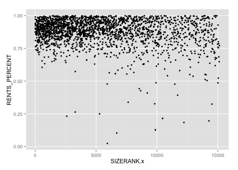
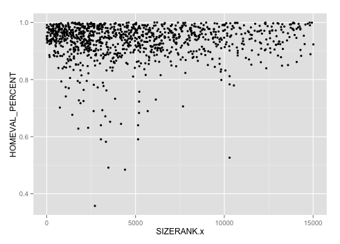
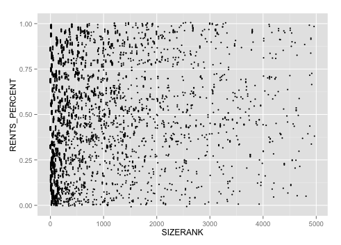
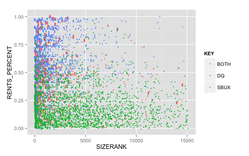

## Step 1: Load CSV File into Oracle:

**Code (Similar for all four datasets):**
```{r, eval=FALSE}
require(tidyr)
require(dplyr)
require(ggplot2)

setwd("~/Desktop/College Notes/Fall 2015/DataVisualization/Project 3/01 Data")

file_path <- "MedianHomeValues.csv"

df <- rename(MedianHomeValues, HOMEVAL = Zhvi)
df <- rename(MedianHomeRents, CITY = Metro)
df <- rename(MedianHomeRents, mmddyy = Date)
df <- rename(MedianHomeRents, ST = State)
df <- rename(MedianHomeRents, Fiveyear = 5Year)
df <- rename(MedianHomeRents, Tenyear = 10Year)
df <- rename(MedianHomeRents, PEAKHOMEVAL = PeakZHVI)# Rename Variables

measures <- c("SizeRank", "HOMEVAL", "MoM", "QoQ", "YoY", "Fiveyear", "Tenyear", "PEAKHOMEVAL", "PctFallFromPeak")

for(n in names(df)) {
  df[n] <- data.frame(lapply(df[n], gsub, pattern="[^ -~]",replacement= ""))
}

dimensions <- setdiff(names(df), measures)
if(length(measures) > 1 || ! is.na(dimensions)) {
  for(d in dimensions) {
    # Get rid of " and ' in dimensions.
    df[d] <- data.frame(lapply(df[d], gsub, pattern="[\"']",replacement= ""))
    # Change & to and in dimensions.
    df[d] <- data.frame(lapply(df[d], gsub, pattern="&",replacement= " and "))
    # Change : to ; in dimensions.
    df[d] <- data.frame(lapply(df[d], gsub, pattern=":",replacement= ";"))
  }
}

# Get rid of all characters in measures except for numbers, the - sign, and period.dimensions
if( length(measures) > 1 || ! is.na(measures)) {
  for(m in measures) {
    df[m] <- data.frame(lapply(df[m], gsub, pattern="[^--.0-9]",replacement= ""))
  }
}

write.csv(df, paste(gsub(".csv", "", file_path), ".reformatted.csv", sep=""), row.names=FALSE, na = "")

tableName <- gsub(" +", "_", gsub("[^A-z, 0-9, ]", "", gsub(".csv", "", file_path)))
sql <- paste("CREATE TABLE", tableName, "(\n-- MedianHomeValues.\n")
if( length(measures) > 1 || ! is.na(dimensions)) {
  for(d in dimensions) {
    sql <- paste(sql, paste(d, "varchar2(4000),\n"))
  }
}
if( length(measures) > 1 || ! is.na(measures)) {
  for(m in measures) {
    if(m != tail(measures, n=1)) sql <- paste(sql, paste(m, "number(38,4),\n"))
    else sql <- paste(sql, paste(m, "number(38,4)\n"))
  }
}
sql <- paste(sql, ");")
cat(sql)
```

## Step 2: Pull data files, rename them MEDIANHOMERENTS, MEDIANHOMEVALUES, STARBUCKS, DAIRYQUEEN:

**Code:**
```{r, eval=FALSE}
require("jsonlite")
require("RCurl")
require(tidyr)
require(dplyr)
require(ggplot2)

MEDIANHOMERENTS <- data.frame(fromJSON(getURL(URLencode('129.152.144.84:5001/rest/native/?query="select * from MEDIANHOMERENTS"'),httpheader=c(DB='jdbc:oracle:thin:@129.152.144.84:1521/PDBF15DV.usuniversi01134.oraclecloud.internal', USER='cs329e_jso464', PASS='orcl_jso464', MODE='native_mode', MODEL='model', returnDimensions = 'False', returnFor = 'JSON'), verbose = TRUE), ))
summary(MEDIANHOMERENTS)
head(MEDIANHOMERENTS)

MEDIANHOMEVALUES <- data.frame(fromJSON(getURL(URLencode('129.152.144.84:5001/rest/native/?query="select * from MEDIANHOMEVALUES"'),httpheader=c(DB='jdbc:oracle:thin:@129.152.144.84:1521/PDBF15DV.usuniversi01134.oraclecloud.internal', USER='cs329e_jso464', PASS='orcl_jso464', MODE='native_mode', MODEL='model', returnDimensions = 'False', returnFor = 'JSON'), verbose = TRUE), ))
summary(MEDIANHOMEVALUES)
head(MEDIANHOMEVALUES)

# Change the USER and PASS below to be your UTEid
STARBUCKS <- data.frame(fromJSON(getURL(URLencode('129.152.144.84:5001/rest/native/?query="select * from STARBUCKS"'),httpheader=c(DB='jdbc:oracle:thin:@129.152.144.84:1521/PDBF15DV.usuniversi01134.oraclecloud.internal', USER='cs329e_jso464', PASS='orcl_jso464', MODE='native_mode', MODEL='model', returnDimensions = 'False', returnFor = 'JSON'), verbose = TRUE), ))
summary(STARBUCKS)
head(STARBUCKS)

DAIRYQUEEN <- data.frame(fromJSON(getURL(URLencode('129.152.144.84:5001/rest/native/?query="select * from DAIRYQUEEN"'),httpheader=c(DB='jdbc:oracle:thin:@129.152.144.84:1521/PDBF15DV.usuniversi01134.oraclecloud.internal', USER='cs329e_jso464', PASS='orcl_jso464', MODE='native_mode', MODEL='model', returnDimensions = 'False', returnFor = 'JSON'), verbose = TRUE), ))
summary(DAIRYQUEEN)
head(DAIRYQUEEN)
```


## Step 3a: Plot 1 - Inner Join



*This shows that in the top 20% most expensive cities, The most expensive rents are in the biggest cities 

**Process:**  
1. Do inner join of MEDIANHOMERENTS and MEDIANHOMEVALUES table based on city and state  
2. Select which rows to use  
3. Create a new column called HOMEVALUE_PERCENT and RENTS_PERCENT  
4. Create a new filter to show only those home values that are the 80% percentile and above  
5. Use the ggplot function to plot based on SIZERANK and RENTS_PERCENT  
6. Identify geom_point as size of 1.5  

**Code:**
```{r, eval=FALSE}
combinedone <- dplyr::inner_join(MEDIANHOMERENTS, MEDIANHOMEVALUES, by=c("CITY", "ST"))

combinedone %>% select(SIZERANK.x, RENTS, HOMEVAL) %>% mutate(HOMEVAL_PERCENT = cume_dist(HOMEVAL), RENTS_PERCENT = cume_dist(RENTS)) %>% filter(HOMEVAL_PERCENT >= .80) %>% ggplot(aes(x = SIZERANK.x, y = RENTS_PERCENT)) + geom_point(size=1.5)
```

## Step 3b: Test assumption in step 2



*However it's very interesting to see that a substantial number of the highest-value homes (top 10%) are not, in fact, in cities with the highest home prices. This signifies that in some cases at the top, home value may not be driven by rent, instead it is noticeably driven by size of the city. 

**Process**  
1. Do inner join of MEDIANHOMERENTS and MEDIANHOMEVALUES table based on city and state  
2. Select SIZERANK.X, RENTS, HOMEVAL  
3. Create a new column called HOMEVALUE_PERCENT and RENTS_PERCENT  
4. Create a new filter to show only those rents that are the 90% percentile and above  
5. Use the ggplot function to plot based on SIZERANK and HOMEVAL_PERCENT  
6. Identify geom_point as size of 1.5  

**Code:**
```{r, eval=FALSE}
combinedone %>% select(SIZERANK.x, RENTS, HOMEVAL) %>% mutate(HOMEVAL_PERCENT = cume_dist(HOMEVAL), RENTS_PERCENT = cume_dist(RENTS)) %>% filter(RENTS_PERCENT >= .90) %>% ggplot(aes(x = SIZERANK.x, y = HOMEVAL_PERCENT)) + geom_point(size=1.5)
```

## Step 4: Plot 2 - Left Join



*Starbucks is most prominent in the biggest cities - in most cases it doesn't even care about having a location in the smaller cities. Within those big cities there is a noticeable tendency toward the big cities with low rent, which seems to suggest that Starbucks, rather than being marketed towards high-income earners, is instead marketed towards low-income earners in big cities.

**Process**  
1. Do left join on STARBUCKS and MEDIANHOMERENTS.  
2. Select STORE_NAME, CITY, STATE, SIZERANK, RENTS  
3. Create new column called RENTS_PERCENT to calculate percentile of each rent  
4. Filter out NA values of RENTS and SIZERANK  
5. Filter SIZERANK to obtain SIZERANK that is less than equal to 5000  
6. Use the ggplot function to blot based on SIZERANK and RENTS PERCENT  
7. Use geom_jitter  

**Code:**
``` {r, eval=FALSE}
leftjoinedone <- dplyr::left_join(STARBUCKS, MEDIANHOMERENTS, by=c("CITY", "ST"))

leftjoinedone %>% select(STORE_NAME, CITY, ST, SIZERANK, RENTS) %>% mutate(RENTS_PERCENT = cume_dist(RENTS)) %>% filter(!is.na(RENTS), !is.na(SIZERANK), SIZERANK <= 5000) %>% ggplot(aes(x = SIZERANK, y = RENTS_PERCENT)) + geom_jitter(size=1, alpha=1,position=position_jitter(height=.01))
```


## Step 5: Plot 3 - Full Join



*While we tend to see Starbucks stores in cities with both high and low rent, the majority of DairyQueen stores are in cities with low rent. They are also not as heavily weighted towards the larger cities as Starbucks is.

**Process**  
1. Do full join of STARBUCKS and DAIRYQUEEN tables by zipcode  
2. Create a new column called CITY that will idenitfy for every row which city the Starbucks store is located in  
3. Create a new column called ST that will idenitfy for every row which state the Starbucks store is located in  
4. Create a new column called KEY to help idenitfy if a particular zipcode only has a Starbucks or only has a Dairyqueen or has both stores.  
5. Do a left join of the full join and MEDIANHOMERENTS by City and State  
6. Plot the graph to show the results  

**Code:**
``` {r, eval=FALSE}
fulljoinedone <- dplyr::full_join(STARBUCKS, DAIRYQUEEN, by="ZIP") %>% mutate(CITY = ifelse(!is.na(CITY.x), paste(CITY.x), paste(CITY.y))) %>% mutate(ST = ifelse(!is.na(ST.x), paste(ST.x), paste(ST.y))) %>% mutate(KEY = ifelse(is.na(STORE_NAME.x), "DQ", ifelse(is.na(STORE_NAME.y), "SBUX", "BOTH"))) %>% filter(!is.na(CITY), !is.na(ST))

leftjoinedtwo <- dplyr::left_join(fulljoinedone, MEDIANHOMERENTS, by=c("CITY", "ST"))

leftjoinedtwo %>% select(KEY, SIZERANK, RENTS) %>% mutate(RENTS_PERCENT = cume_dist(RENTS)) %>% filter(!is.na(RENTS), !is.na(SIZERANK)) %>% ggplot(aes(x = SIZERANK, y = RENTS_PERCENT)) + geom_jitter(size=1, alpha=1,position=position_jitter(height=.01), aes(colour = KEY))
```
